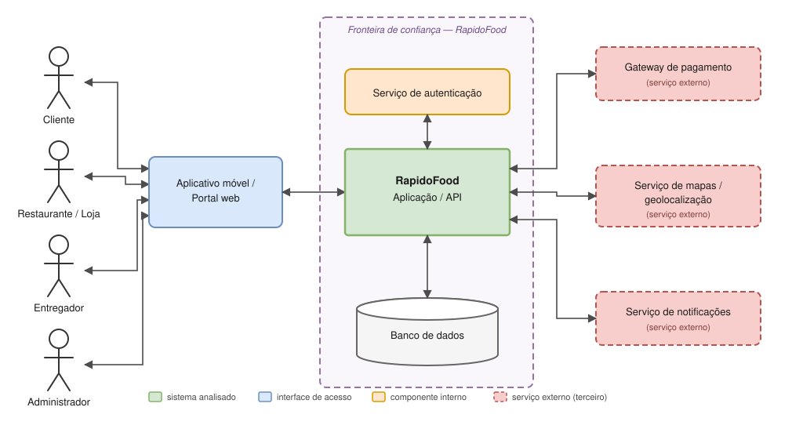

## 3. Usuários, ativos e pontos de interação

### 3.1 Usuários e perfis

| Usuário ou perfil | Descrição e Permissões | Principais ações |
| --- | --- | --- |
| **Cliente** | Usuário final da plataforma | Consultar restaurantes e produtos, montar carrinho, aplicar cupons, realizar pedidos, efetuar pagamentos, acompanhar a entrega em tempo real, interagir via chat e avaliar o serviço. |
| **Restaurante / Loja** | Parceiro comercial credenciado | Cadastrar e editar o cardápio (produtos e preços), gerenciar horários de funcionamento, receber/aceitar/recusar pedidos, atualizar o status de preparo e solicitar suporte. |
| **Entregador** | Prestador de serviço de logística | Visualizar corridas disponíveis, aceitar chamadas, acessar rota e endereço de entrega, transmitir geolocalização em tempo real e confirmar a entrega via código/validação. |
| **Administrador** | Gestor do sistema com privilégios elevados | Gerenciar contas e níveis de acesso, moderar cadastros de lojas e entregadores, resolver disputas financeiras/reembolsos, visualizar logs de auditoria e configurar parâmetros da plataforma. |

---

### 3.2 Ativos importantes

São considerados ativos importantes todos os dados e recursos do sistema que necessitam de garantias de **Confidencialidade**, **Integridade** e **Disponibilidade (CID)** para evitar prejuízos operacionais, financeiros ou reputacionais:

*   **Credenciais de Acesso e Autenticação:** Hashes de senhas, tokens de sessão (JWT), chaves de API e tokens de autenticação multifator de todos os perfis.
*   **Dados Pessoais Identificáveis (PII):** Nomes completos, e-mails, telefones, CPF/CNPJ e endereços cadastrados e de entrega (sujeitos à legislação de proteção de dados).
*   **Dados e Transações Financeiras:** Tokens de cartão de crédito fornecidos pelo gateway, histórico de pagamentos, repasses a restaurantes/entregadores e chaves PIX.
*   **Dados de Localização em Tempo Real:** Coordenadas de geolocalização (GPS) contínuas de entregadores e clientes durante o processo de entrega.
*   **Integridade do Negócio e Pedidos:** Preços dos produtos, valores de frete, regras de cálculo do carrinho, cupons de desconto e status transacional dos pedidos.
*   **Comunicações e Interações:** Histórico de mensagens enviadas no chat interno (Cliente ↔ Entregador ↔ Suporte) e registros de avaliações/notas.
*   **Registros de Auditoria (Logs):** Trilha de auditoria das operações realizadas no sistema, alterações de permissão e acessos a dados sensíveis.
*   **Disponibilidade do Serviço:** Infraestrutura de servidores, APIs e banco de dados mantida operacional, especialmente em horários de pico de demanda.

---

### 3.3 Pontos de interação e componentes

| Elemento | Tipo | Função e Considerações de Segurança |
| --- | --- | --- |
| **Aplicativo Móvel / Web** | Cliente (Frontend) | Interface do cliente, restaurante e entregador. Ponto de entrada de requisições; exige validação e sanitização estrita no servidor. |
| **Serviço de Autenticação** | Componente Interno | Emite e valida tokens de acesso (JWT/OAuth2), gerencia sessões e controla o controle de acesso baseado em funções (RBAC). |
| **Aplicação / API Gateway** | Componente Interno | Centraliza e processa as regras de negócio, valida os dados de entrada, autoriza chamadas e redireciona tráfego com proteção HTTPS/TLS. |
| **Banco de Dados Relacional** | Armazenamento | Armazena dados cadastrais, pedidos, logs e configurações. Deve possuir controle rígido de acesso, encriptação em repouso e backups segregados. |
| **Gateway de Pagamento** | Serviço Externo | Processa transações via cartão e PIX de forma segura (aderente ao padrão PCI-DSS), retornando apenas confirmações/tokens. |
| **Serviço de Mapas e Geolocalização** | Serviço Externo | Processa coordenadas GPS e calcula rotas/estimativas de entrega via APIs externas com autenticação por chave de API restrita. |
| **Serviço de Notificações (Push/SMS/E-mail)** | Serviço Externo | Dispara alertas sobre status do pedido e códigos de verificação em dois fatores (2FA). |

---

### 3.4 Diagramas

- [Diagrama de contexto](diagramas/diagrama-contexto.md) — Visão dos atores, plataforma e serviços externos integrados.
- [Diagrama de contexto detalhado](#41-diagrama-de-contexto) — versão com fronteira de confiança e legenda (seção 4.1 abaixo).
- [Diagrama de fluxo de dados](diagramas/diagrama-fluxo-de-dados.md) — Mapeamento do caminho dos dados desde a criação até a entrega do pedido.

## 4. Visão geral da arquitetura ou fluxo

### 4.1 Diagrama de contexto

O diagrama abaixo apresenta uma visão simplificada de como os usuários e os
componentes do RapidoFood interagem. Os quatro perfis de usuário acessam o
sistema sempre pelo aplicativo móvel ou pelo portal web, que por sua vez se
comunica com a aplicação/API central. Dentro da fronteira de confiança ficam os
componentes controlados pela equipe (API, serviço de autenticação e banco de
dados); fora dela, em vermelho tracejado, estão os três serviços de terceiros.

> Arquivo-fonte do diagrama, versionado no repositório:
> [`diagramas/diagrama-contexto-detalhado.svg`](diagramas/diagrama-contexto-detalhado.svg)
> — formato vetorial em texto, que serve tanto de imagem quanto de fonte editável.
> Existe também uma versão simplificada em Mermaid
> ([`diagramas/diagrama-contexto.md`](diagramas/diagrama-contexto.md)), mantida
> como referência rápida.

### 4.2 Fluxo principal de um pedido

1. O **cliente** se autentica pelo aplicativo; o serviço de autenticação valida
   as credenciais e devolve a sessão.
2. O cliente busca restaurantes e monta o carrinho; a API consulta o cardápio no
   banco de dados.
3. Ao finalizar, a API envia os dados da transação ao **gateway de pagamento** e
   aguarda a confirmação.
4. Confirmado o pagamento, o pedido é registrado e o **restaurante** recebe a
   solicitação para preparo.
5. Um **entregador** aceita a corrida e passa a enviar sua localização, que a API
   repassa ao serviço de mapas e ao aplicativo do cliente.
6. A cada mudança de status, o serviço de notificações avisa os envolvidos.
7. Concluída a entrega, o cliente pode avaliar o pedido, e o **administrador**
   acompanha a operação e trata eventuais disputas.

### 4.3 Pontos sensíveis do fluxo

Do ponto de vista de segurança, três travessias merecem atenção especial, porque
é nelas que dados sensíveis saem do controle direto da aplicação:

| Travessia | Dados que circulam | Preocupação principal |
| --- | --- | --- |
| Aplicativo ↔ API | credenciais, endereços, pedidos e valores | é o ponto exposto à internet e a porta de entrada da maioria dos ataques |
| API ↔ gateway de pagamento | dados de pagamento e valores das transações | depende de um terceiro; uma falha na integração afeta diretamente o dinheiro |
| API ↔ aplicativo do entregador | nome, telefone, endereço e localização em tempo real | expõe dados pessoais do cliente a um usuário que não faz parte da plataforma de forma permanente |

Essa última travessia é justamente a origem das ameaças de exposição de
informações descritas em T04 e T10 na
[modelagem de ameaças](<Passo 2 (Entregavel 1) - Modelagem de ameaças e Casos de Abuso.md>).
