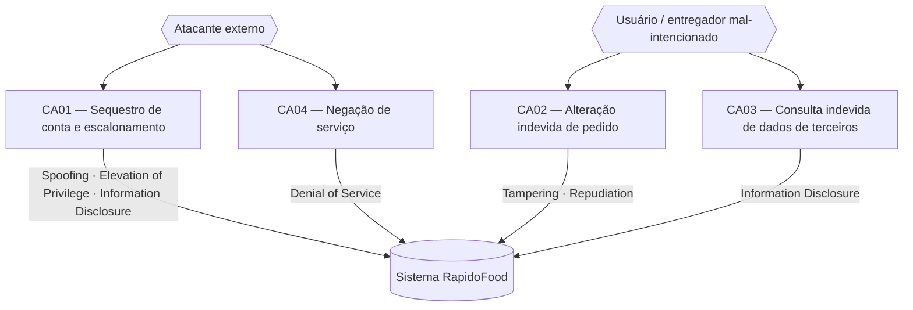

# Diagrama de casos de abuso — RapidoFood

Relaciona os atores maliciosos, os casos de abuso (CA01–CA04) e as categorias
STRIDE envolvidas. O código Mermaid abaixo é o **arquivo-fonte**; o GitHub o
renderiza como imagem.

