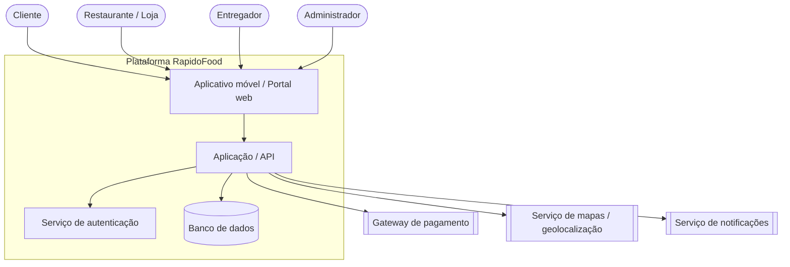

# Diagrama de contexto — RapidoFood

Mostra os usuários, a plataforma (componentes internos) e os serviços externos.
O código Mermaid abaixo é o **arquivo-fonte**; o GitHub o renderiza como imagem.

