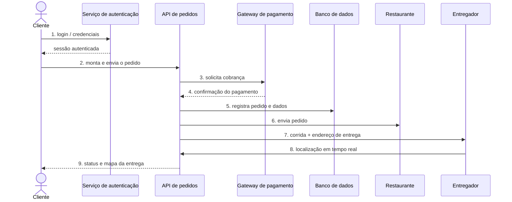

# Diagrama de fluxo de dados — Pedido no RapidoFood

Mostra, em ordem, o caminho dos dados desde o login do cliente até a entrega. O
código Mermaid abaixo é o **arquivo-fonte**; o GitHub o renderiza como imagem.
Uma imagem PNG de backup está em [`imagens/`](../imagens/).

