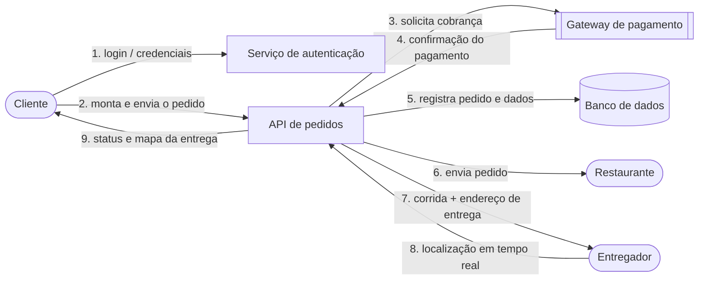

# Diagrama de fluxo de dados — Pedido no RapidoFood

Mostra o caminho dos dados desde o login do cliente até a entrega. O código
Mermaid abaixo é o **arquivo-fonte**; o GitHub o renderiza como imagem.

