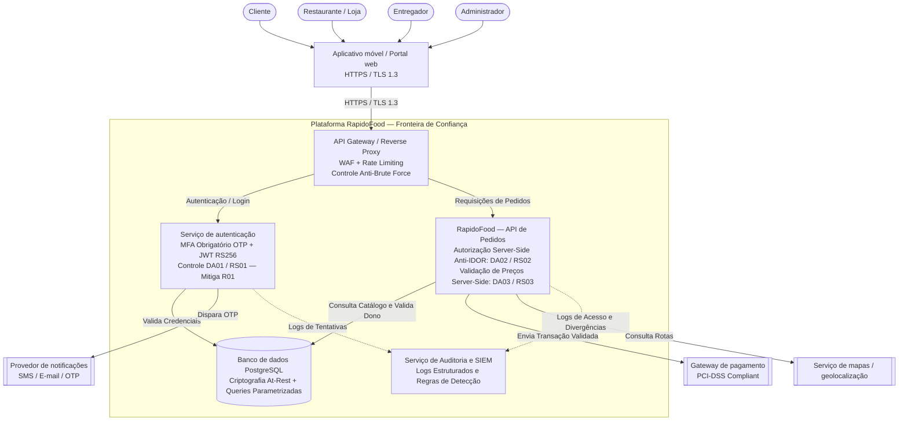

# Diagrama de Arquitetura Segura — RapidoFood

**Etapa 3 — Projeto de uma Arquitetura Segura**  
**Responsável:** Lucas Kaue Ribeiro Weber  
**Sistema:** RapidoFood (App de Delivery)

Este documento apresenta o diagrama da arquitetura segura do RapidoFood, evoluindo a partir do diagrama de contexto da Etapa 1. Ele detalha a fronteira de confiança, a camada de perímetro (API Gateway + WAF + Rate Limit), os serviços internos com seus respectivos controles mitigadores (DA01, DA02, DA03), a camada de auditoria e logs (SIEM) e as integrações externas.

O código Mermaid abaixo é o **arquivo-fonte**; o GitHub o renderiza diretamente como imagem. A imagem vetorial em SVG está disponível em [`arquitetura-segura.svg`](arquitetura-segura.svg).

---

## Diagrama da Arquitetura Segura (Mermaid)

---

## Descrição dos Componentes e Controles de Segurança

1. **Atores e Camada de Apresentação:** Clientes, entregadores, restaurantes e administradores comunicam-se com o RapidoFood exclusivamente através de canais criptografados (`HTTPS / TLS 1.3`).
2. **API Gateway & WAF:** Ponto único de entrada com mitigação perimetral. Aplica *Rate Limiting* (limite de requisições por IP/rota) para conter ataques de negação de serviço e força bruta contra o endpoint de autenticação.
3. **Serviço de Autenticação (Auth Service):**
   - **MFA Obrigatório:** Implementa o controle **DA01 / RS01** para mitigar o sequestro de contas (**R01**), enviando códigos de uso único (OTP) via serviço externo de notificações.
   - **Gerenciamento de Tokens JWT:** Emissão de tokens criptograficamente assinados (RS256) com tempo de expiração curto e revogação dinâmica.
4. **Serviço de Pedidos (Order Service):**
   - **Módulo de Autorização de Nível de Objeto:** Implementa o controle **DA02 / RS02** para mitigar a exposição indevida de dados (**R06 / IDOR**), garantindo que apenas o usuário autenticado (`token.user_id`) acesse os dados de seu respectivo pedido (`pedido.cliente_id`).
   - **Validação Server-Side de Preços:** Implementa o controle **DA03 / RS03** para mitigar fraudes de adulteração (**R04 / Tampering**), recalculando preços de produtos e taxas diretamente a partir da base de dados e serviço de logística antes de qualquer chamada ao Gateway de Pagamento.
5. **Persistência Segura (Banco de Dados):**
   - Acesso via consultas parametrizadas (*Prepared Statements*) prevenindo injeções de SQL.
   - Criptografia em repouso (*at-rest*) para proteção de dados pessoais (LGPD).
6. **Auditoria e Detecção (SIEM):**
   - Todos os componentes emitem logs estruturados para o serviço central de auditoria, alimentando as regras de detecção de intrusões (Etapa 6).
